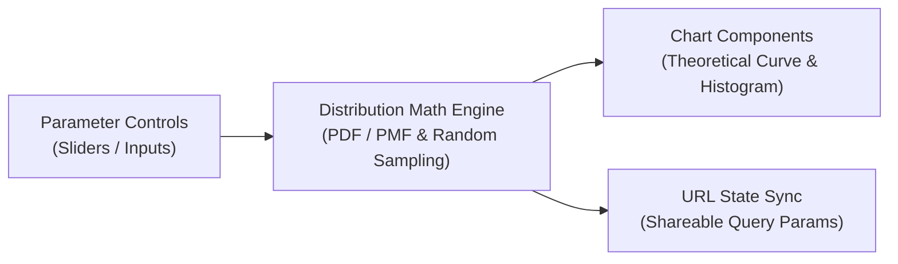

# Probability Distribution Visualizer

An interactive web application for exploring and visualizing standard probability distributions in real time.  
Adjust parameter sliders and immediately see probability density (PDF) and mass (PMF) charts react dynamically.

---

## Key Features

- **Visual Use-Case Finder**: Open “Find by use case” to choose an illustrated quantity and a real-world situation, check candidate distributions and assumptions, then try the matching chart. No knowledge of distribution names is needed.
- **10 Core Distributions**: Covers foundational distributions organized logically (Bernoulli, Binomial, Poisson, Geometric, Negative Binomial, Normal, Log-Normal, Exponential, Gamma, and Beta).
- **Interactive Controls & Sampling**: Real-time parameter sliders with empirical sample histograms overlaid against theoretical curves.
- **Contextual Explanations**: Plain-language real-world use cases with active parameters woven directly into the text.
- **Deep Linking**: Complete application state (parameters, card visibility, sort order, theme, language) is continuously synchronized to the URL query for easy sharing.
- **Bilingual & Responsive**: Full Japanese / English localization and Dark / Light theme support.

---

## Application Flow



---

## Tech Stack

- **Frontend**: React, TypeScript, Vite
- **Math & Charts**: Custom mathematical distribution functions, Canvas / SVG rendering
- **Quality & Styling**: Biome, Vitest, Testing Library
- **Environment**: Docker, Docker Compose

---

## Local Development

The project is fully containerized, so Node.js does not need to be installed on your host machine.

### Quick Start

```bash
# Start dev server (http://localhost:5173)
docker compose up
```

### Development Commands

Run quality checks and test suites through the container:

```bash
# Unit & component tests
docker compose run --rm app npm test

# TypeScript type verification
docker compose run --rm app npm run typecheck

# Lint & formatting check
docker compose run --rm app npm run lint

# Production build
docker compose run --rm app npm run build
```

---

## Deployment

Pushing to the `main` branch automatically triggers GitHub Actions to run tests, build static assets, and deploy to GitHub Pages.
